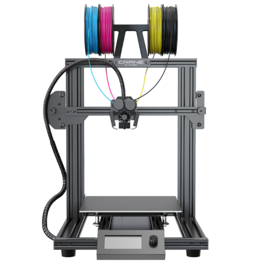

# Welcome

Welcome and thank you for choosing the M3D Crane series of printers! From here you will be able to navigate through our series of Quick Start guides for the Crane Line. First select the Model style of M3D Crane you have purchased and you will be directed to the Quick Start Guide that matches your new printer.

| **The Crane Bowden** | **The Crane Quad** |
| :---: | :---: |

|  |  |
| :---: | :---: |

| Quick Links -- Bowden | Quick Links -- Quad |
| :---: | :---: |
| [Assembly Guide](https://crane.printm3d.com/m3d-crane-bowden-quick-start-guide) | [Assembly Guide](https://crane.printm3d.com/m3d-crane-quad-quick-start-guide) |
| [Network Setup](https://crane.printm3d.com/crane-bowden-guide/first-time-network-setup) | [Network Setup](https://crane.printm3d.com/crane-quad-guide/first-time-network-setup) |
| [Duet Web Control First Look](https://crane.printm3d.com/crane-bowden-guide/intro-to-duet-web-control) | [Duet Web Control First Look ](https://crane.printm3d.com/crane-bowden-guide/intro-to-duet-web-control) |
| [Bed/Nozzle Control](https://crane.printm3d.com/getting-started/heating-the-bed-and-nozzles) | [Bed/Nozzle Control](https://crane.printm3d.com/getting-started/heating-the-bed-and-nozzles) |
| [Loading/Unloading Filament](https://crane.printm3d.com/m3d-crane-bowden-quick-start-guide#loading-and-unloading-filament) | [Loading/Unloading Filament](https://quadfusion.printm3d.com/printing-guides/new-loading-and-unloading-filament) |
| Slicer Profile Guide | Slicer Profile Guide |
| Your First Print | Your First Print |
| [Bed Leveling](https://crane.printm3d.com/crane-bowden-guide/manual-bed-leveling) | [Bed Leveling](https://crane.printm3d.com/manual-bed-leveling) |

