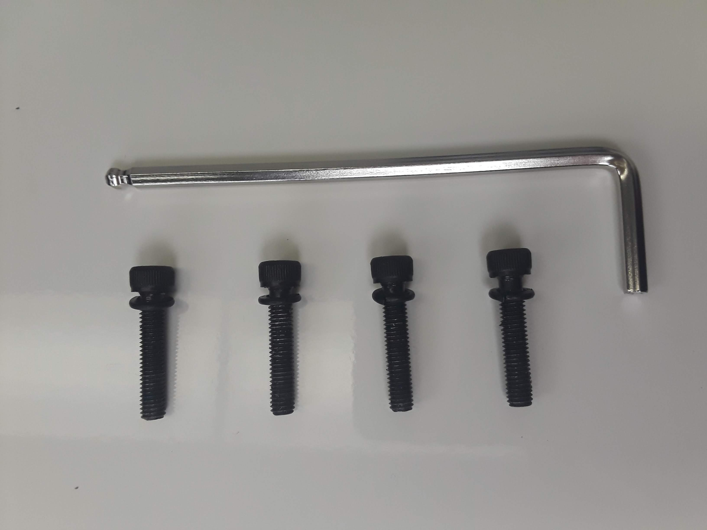
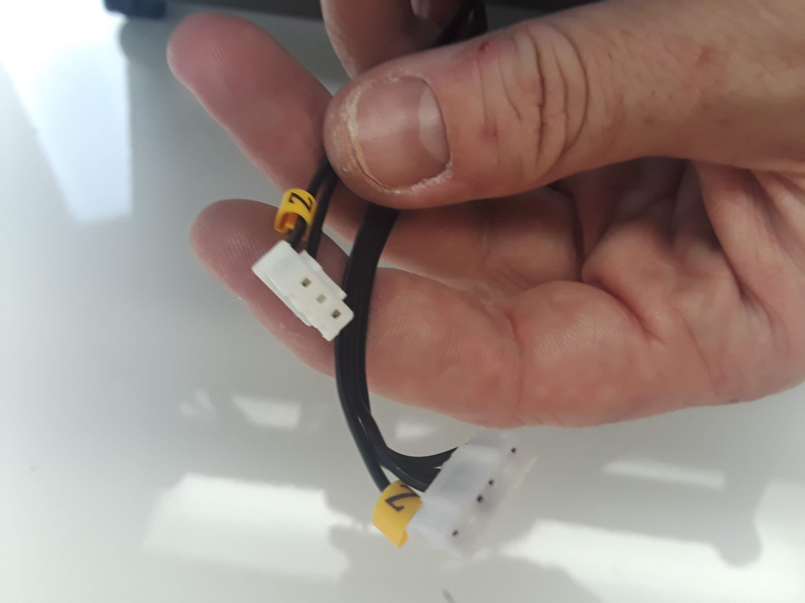
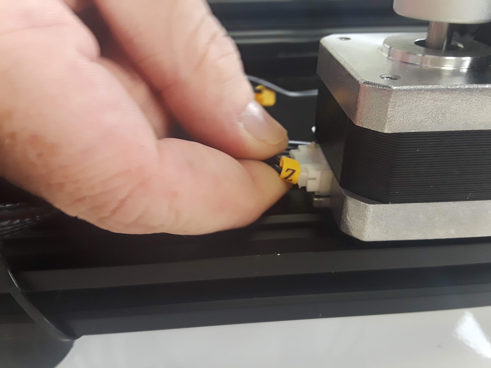
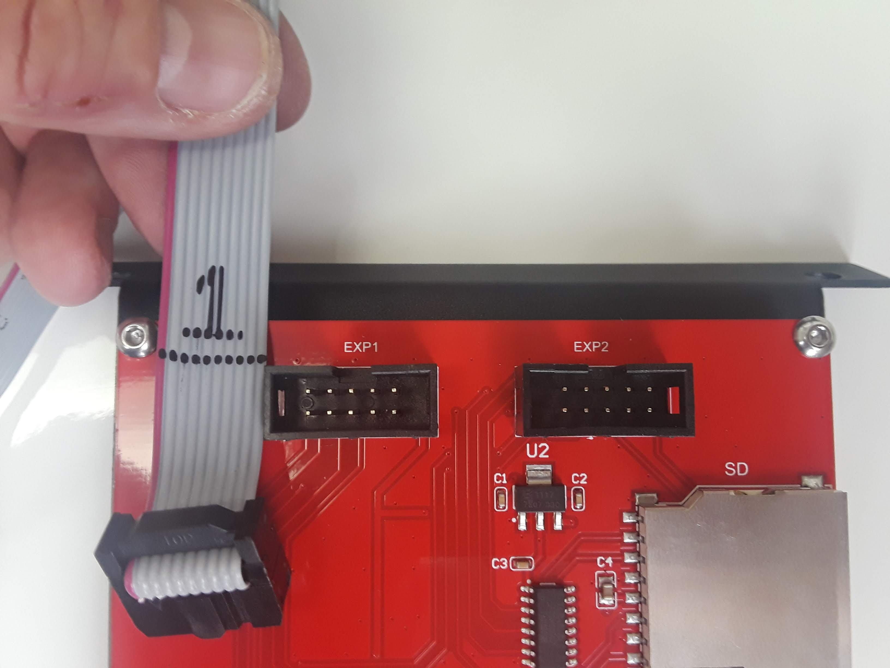
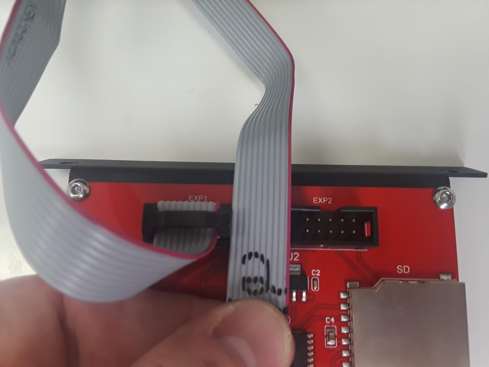
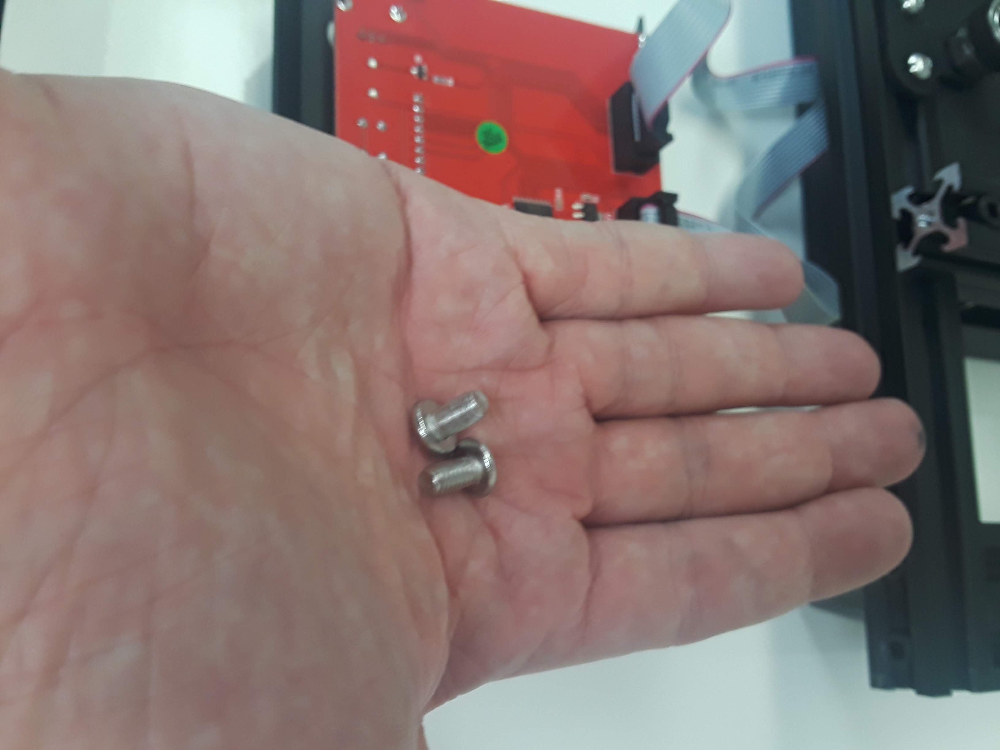

# Unboxing/Assembly


The M3D Crane Bowden contains sensitive electronics, delicate mechanical parts, and an electrical heating system. Please exercise all applicable safety precautions and follow this guide closely to avoid damage to your M3D Crane Bowden, to avoid injury to yourself or others, and insure proper operation.


## Setting up after unboxing your printer: 

After removing your M3D Crane Bowden from the box, remove all the plastic wrapping being careful not to cut any of the sensitive parts of the device, such as the cables. Your M3D Crane Bowden should look like this:

Remove the bolts at the bottom of each upright rail, as shown below. Setting them aside briefly:


Inspect your M3D Crane Bowden for any damage that may have occurred during shipping. Every precaution has been made to prevent this, however it is advisable to give all the components a thorough inspection before operation. If any issues are discovered, document the damage by taking an image of the affected area and contact M3D immediately.


 As long as no issues are discovered, you are ready for mechanical assembly. 

## Assembly: 

Being careful not to stress or pull any of the cables, have a friend assist you in raising the upright rails; be sure to **align the bolt holes**.

If you aren't able to hold the upright in place, get someone's help to steady it. Line up the bolt holes\(that previously housed the bolts you removed\) and begin slowly tightening the bolts; first hand tighten, then slowly tighten more firmly with the provided **Allen Key**.

Ensure that all motor cables are connected. These are part of the **black ribbon cable**. You can identify the correct motor cable by looking at the **yellow tags reading 'X, Y, and Z'.** The motor connections are made up of 4 wires, while the associated endstop cable is a three wire cable directly beside the 4-wire cable for the respective motor; the only motor without an endstop is the extruder.

Connect the two gray ribbon cables labeled '1' and '2' and connect them to their respective ports on the back of the LCD assembly, 'EXP1' and 'EXP2'. **Be careful not to cross these connections as it may damage the LCD Screen.**

After making the connections, use the provided bolts and Allen Key to secure the LCD to the front of the M3D Crane Bowden.


Prior to exiting this section, please double check all connections, and place your crane on a flat surface. Ensure the Power Switch is Off\(O\), double check that your voltage is set appropriately for YOUR area\(consult local authorities if you are unsure\). **Failure to do this can irreparably harm the electronics in your printer.**


Once your M3D Crane Bowden is complete it should look like this:

Congratulations!! You have completed the Assembly of your M3D Crane Bowden Printer!! In the next section you will learn how to include your new M3D Crane Bowden into your existing network, or set up a network from scratch.  

