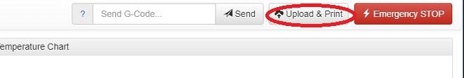
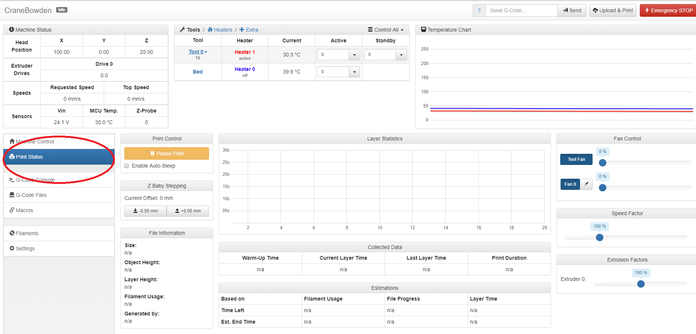

# First Print

## Uploading and Printing:

In the **upper right corner** of the Duet Web Control Interface click on the **Upload and Print** button. 

When you click on the **Upload and Print** button it will open a window that allows you to choose which gcode file you want to upload. The file will then be uploaded and the printing process will begin. 

The bed as well as the nozzle will begin to heat up according with the settings contained within the gcode file provided by your slicer, and once it's up to temp the print will start.  

## Print Status:

Near the **lower left corner** of the Duet Web Control Console there are tabs. Underneath the Machine Control tab will be **Printer Status**. 

Clicking on the Print Status tab will open a Print Control screen where you can monitor many aspects of your print as well as make changes in real time during the printing process. 


It's recommended that you do not make any changes without first doing further reading so as to not inadvertently cause damage to the print OR your M3D Crane Series Printer.   


 

