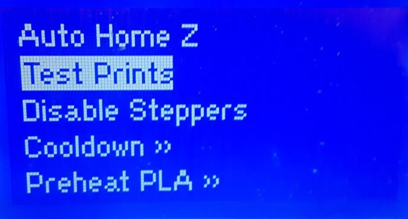
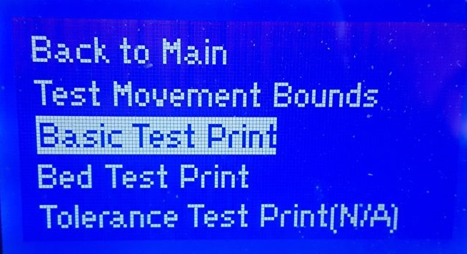

# First Print

Now that we've covered the very basics on the Duet Web Control Interface, and ran the Bed Leveling Assistant it's time to GET PRINTING. 

## Test Prints: print the test prints first

Before you start slicing and printing your own models it is highly recommended that you print the Test Prints that come pre-loaded for your M3D Crane Series printer. To ensure that your M3D Crane Series printer is operating exactly as intended, we've included several Test Prints that have been created in order to ensure optimal functionality. These test prints are already sliced and ready to go. You can access the Test Prints via the LCD screen Menu.  


Be sure to use the Sample Filament that came with your M3D Crane Series printer for your Test Print!!  


### To access the Test Prints:

* Select **Prepare**
* Move the knob to scroll through the Menu and Select **Test Prints**
* Select **Basic Test Print**

The Test Print will start running once selected. It may take several moments to start as the bed and the nozzle will need to get up to running temperature. Be sure to save detailed images of your Test Prints! 

## Uploading and Printing:

After you have printed the Test Prints it's time to start printing your own models! Here you will be shown how to upload and print via the Duet Web Control Interface. 

In the **upper right corner** of the Duet Web Control Interface click on the **Upload and Print** button. 

When you click on the **Upload and Print** button it will open a window that allows you to choose which gcode file you want to upload. The file will then be uploaded and the printing process will begin. 

The bed as well as the nozzle will begin to heat up according with the settings contained within the gcode file provided by your slicer, and once it's up to temp the print will start.  

## Print Status:

Near the **lower left corner** of the Duet Web Control Console there are tabs. Underneath the Machine Control tab will be **Printer Status**. 

Clicking on the Print Status tab will open a Print Control screen where you can monitor many aspects of your print as well as make changes in real time during the printing process. 


It's recommended that you do not make any changes without first doing further reading so as to not inadvertently cause damage to the print OR your M3D Crane Series Printer.   


 

