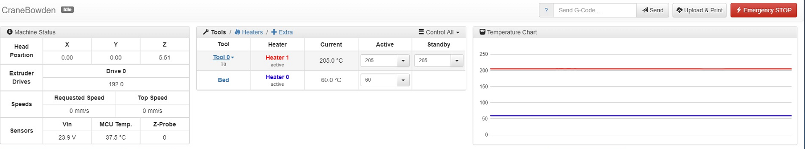

# First look at Duet Web Control

## Getting to know your Duet Web Control Interface:

Now that the **Network Setup** is complete and you have arrived at the IP address your M3D Crane Series printer displayed during the Network Setup process, you can start to utilize the **Duet Web Control Interface**. There are many aspects you are able to monitor and control before, during and after printing from the Duet Web Control Interface. Here we will go over just the basics needed to get you up and printing as quickly as possible. 

## Duet Web Control Interface First Look:


The Duet Web Control Interface provides a comprehensive way to monitor and make changes to nearly all aspects of your 3D printing process. This guide is focused on getting your M3D Crane Series printer up and printing quickly. Links will be provided at the end of this tutorial to allow a more in-depth understanding of all the various functions of the Duet Web Control Interface. 


## The upper portion of the Duet Web Control Interface will display real time information:

The **Machine Status** section displays the **current axis positions, extruder drive positions, Speeds and Z-probe reading**.

 The **Tools** section provides a place to input and monitor the **temperature** of the various tools such as the **nozzle** and the **bed**.

 The **Temperature Chart** section will provide a real time chart showing the **temperature increase and decrease of the bed and the nozzle**. 

## The Lower portion of the Duet Web Control Interface is Dynamic: 

 It contains the **Main Menu Section**, which is comprised of tabs that display their information/interface in the middle portion of the lower half of the Duet Web Control Interface. Under the Machine Control tab you can find the **Axes and extruder control.** The Lower left portion contains the **User-Defined Macros** section.

## Print Status Tab: 

The **print status tab** will not display any information until a print is started, but once you have uploaded and started a print you will see **real time progress** as well as be able to **make changes in real time** to your print as it's printing, such as **micro stepping** or using the **Fan Control section**, changing **fan speeds and ratios.**

 The **Print control** section enables you to **pause, cancel or resume** a print, and allows you to make small adjustments to the Z axis called **Z baby stepping**.

 The **File information** section **displays select information about the gcode file you have uploaded** to print.

## **G-Code Console:**

The G-code console is a vital to an experienced 3D printing user. This tab allows you to enter any RepRap Firmware supported command. The printer will execute any command entered here and print feedback and errors. 

Visit the [RepRap Firmware G-Code](https://reprap.org/wiki/G-code) website to learn more about all possible G-codes. Be careful when entering G-code commands as the printer will execute whatever you command you send it.

**G-code Files**

This tab is used to upload G-code files to the Duet board. Use the **Upload G-code File\(s\)** __button in order to upload a _._**gcode** file to the printer in order to print it. Click on an uploaded file in order to print it. You also have the ability to create directories here in order to organize your files. 

## **Macros:**

Macros are useful when you find yourself repeatedly performing a sequence of G-code commands. You can easily put these commands into a macro file and upload it here. Click a macro file in order to execute it.

User defined macros are stored in this tab. Use the dark-blue **Upload Macro File\(s\)** button to upload **.gcode** macro files. 

## **Filaments:**

Utilize this tab in order to define printer filament settings. This can also be performed in Slicer Software

Each loaded filament, once loaded, is automatically saved in a new file called **/sys/filaments.csv**. This file may be enhanced in the future to include usage statistics for different materials.

## **Settings:**

**This tab is one of the most important**. This tab allows you to change the **sys/** directory in your SD card and define other user settings.

When any future updates are released it may be necessary to access the system files such as **config.g** or a **machine.g** file, you can change the files in the settings tab. The Settings tab includes more tabs:

* General: Includes firmware and web console information
* User Interface: Change the look and feel of the Duet Web Console
* List Items: Includes web page suggested options
* System Editor: A very useful tab to change files in the _sys/_ directory of your microSD card. **You will find the** _**config.g**_ **file here as well as other system G-code files.**
* Machine properties: Defines properties of the different drives \(motors\) of the printer.
* Tools: Defines the properties of the tools.

These are the very basics of the Duet Web Control Interface. We'll go over more about the Macro function during the Bed Leveling Assistant section of this guide, but for more comprehensive and in-depth information on each of the features of the Duet Web Control Interface, click [HERE](https://duet3d.dozuki.com/Wiki/Duet_Web_Control_Manual#Section_Overview).

Now that you are more familiar with both the LCD navigation menu as well as Duet Web Control, it's time to move on to Bed Leveling which will be addressed in the next section.    

 

