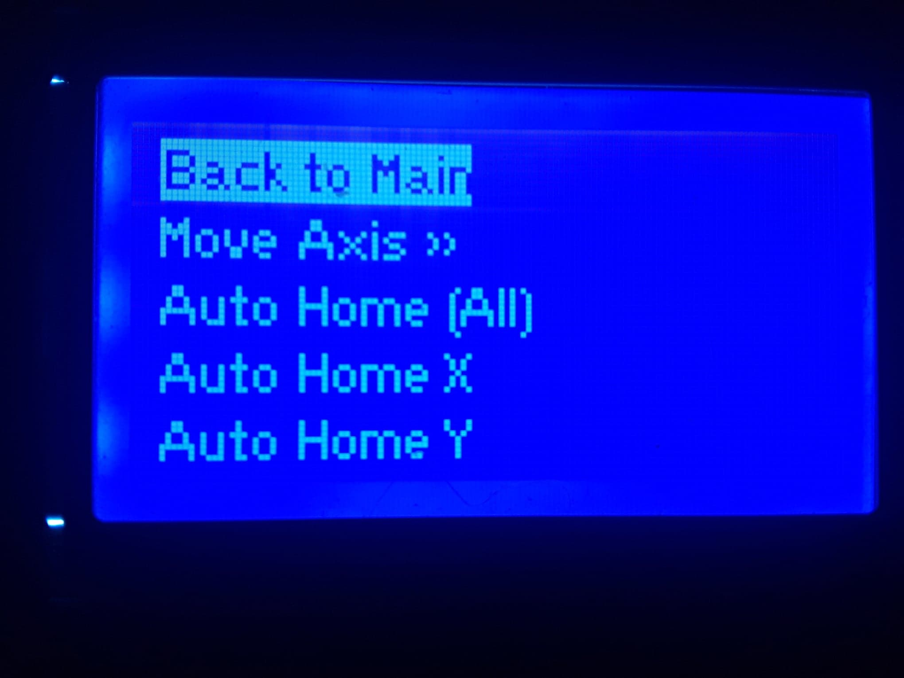
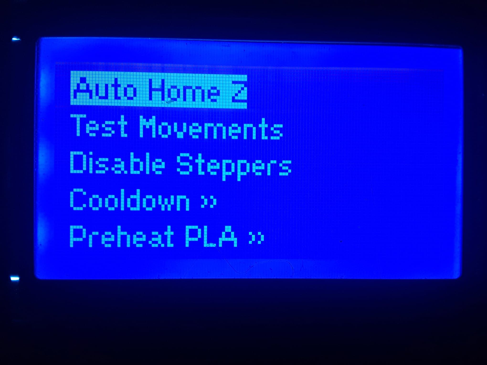
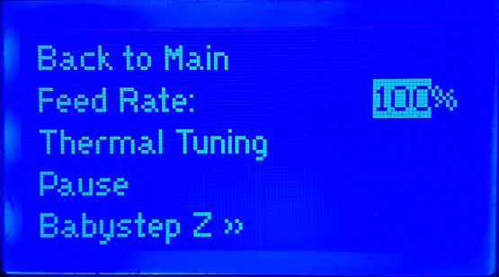

# LCD Menu Navigation

## Getting to know your M3D Crane Series printer's LCD Menu Display:

Below is an image of the **Standby screen** of your M3D Crane Series printer. While in **Standby** mode, or while it's not actively printing the LCD screen will display the following information:

* **Nozzle**: this will display the nozzle's **current temperature as well as the nozzle's set temperature**. To **Set the Nozzle Temp** simply move the knob in order to **highlight the temperature values** in the Nozzle row. Once highlighted, **depress the knob once to select**, then **turn the knob until the desired temperature is displayed** and select by depressing the knob once more.  
* **Bed**: this will display the c**urrent bed temperature** as well as the **set bed temperature**. To set the Bed Temp, simply follow the directions as if you were changing the nozzle temp but apply them to the Bed row. 
* **Feed Rate**: this displays your **current feed rate**. To change the **Feed Rate**, simply **select the value and adjust with the knob.**
* **IP**: this displays the **IP address of your M3D Crane Series printer on your network**. The **Network Setup** section of this guide shows how to access the **Duet Web Control Interface** via this IP address. The displayed values of the IP address are not able to be selected nor changed from this menu. 
* **Prepare**: selecting Prepare will change the LCD screen Menu to an additional menu page.

 

## Prepare: Or Main Menu page 2

* **Back to Main**: selecting Back to Main will bring you back to the Main, or Standby menu. 
* **Move Axis**: selecting Move Axis will bring you to a sub-menu where you can select each axis including the extruder, in order to move each axis independently OR extrude and retract filament. 

* **Auto Home \[All\]**: selecting Auto Home \[All\] will **home ALL axis.**
* **Auto Home X:** this will Auto Home **ONLY the X axis.**
* **Auto Home Y:** this will Auto Home **ONLY the Y axis.** 

## Main Menu Page 3:

* **Auto Home Z**: this will Auto Home **ONLY the Z axis.**
* **Test Movements:** this will run your M3D Crane Series printer through a series of Test Movements. 
* **Disable Steppers**: this will **disable the stepper motor**s to enable you to move your bed and the print head freely. 
* **Cooldown**: this will **cool the bed and the print head.** 

There are other aspects of the menu such as the Preheat various materials options. Those shall be discussed in additional guides. 

## Active Print Mode Menu:

The **Active Print Mode Menu** gives you a different set of options while your M3D Crane Series printer is actively printing. Instead of seeing Prepare in the bottom right corner of your LCD menu, while in print mode your M3D Crane Series will display **Tune:**

The Tune Menu will give you control over various aspects of your print while it's printing.

* **Thermal Tuning:** this will allow you to control fan settings. 
* **Pause/Resume:** Pause allows you to pause your print at any time, while in pause mode the Resume option will be available, this will resume the print from the point at which it was paused.  
* **Baby Step Z:** this will move the Z axis in positive or negative .01 or .05mm "baby" movements.  
* **Cancel Active Print:** will allow you to Cancel the print at any time should you choose to for any reason. 

