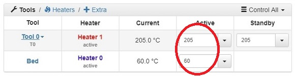
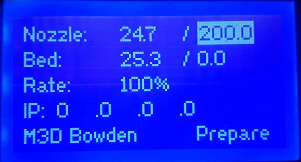
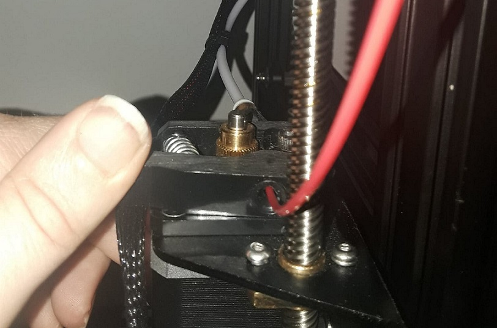
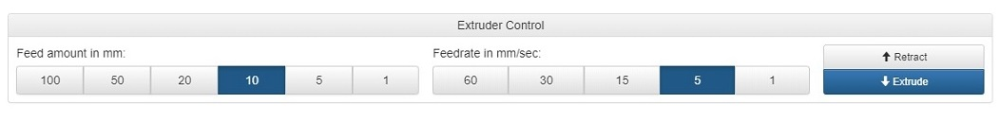
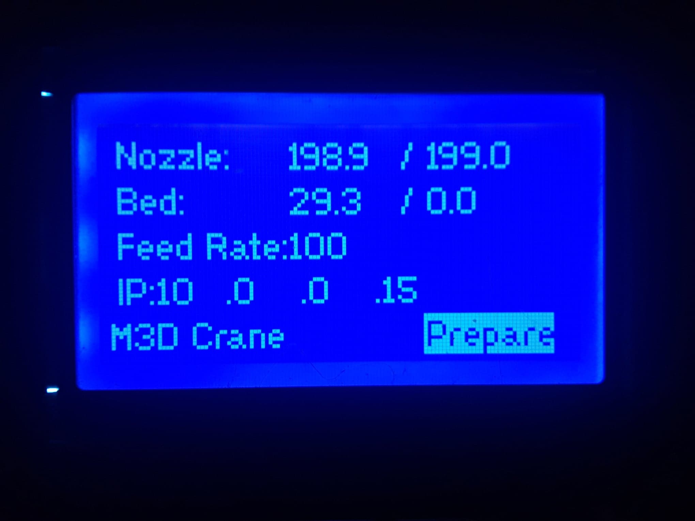
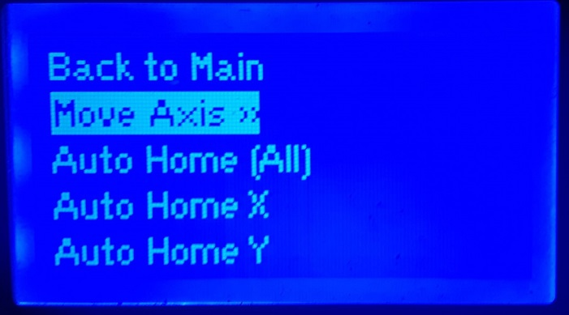
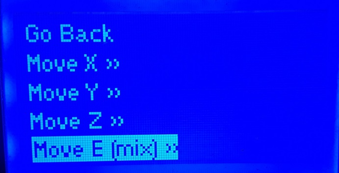
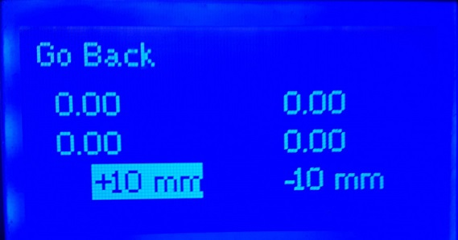

# Loading and Unloading Filament

## Loading and Unloading Filament:

Once your printer has been **homed** you will need to **heat the nozzle** in order to **load your filament** and start your print.

The temperature of the nozzle will be dependent upon the type of filament you choose to use for your first print, for the included test print we ask that **PLA** be used. Recommendations vary on the best temperature to use for PLA, but for this test print we ask that you **heat the nozzle to 200C.**

Using your **Duet Web Control Interface** you can set your nozzle tool temperature in the tools section by clicking in the Active column in the Tool 0 row. 

Using the LCD Menu on your M3D Crane Bowden you can set the nozzle temperature simply by using the knob to select the temperature value and turn the knob further until you reach and select the desired setting:

 

Once your nozzle is up to temp you may insert your **PLA** filament. Send **filament** through the entrance of the **extruder** **located at left side of the printer**. While **compressing the leaver on the extruder, feed the filament on through the bowden tube and into the hot end**.

 As the filament hits the hotend, it will heat up and start to liquefy. The filament will then start to seep out of the nozzle.


It is recommended to **extrude 50 to 100 mm** of filament right away to ensure correct loading, heating, and that there are no blockages in the nozzle or bowden tube. 


Using the **Duet Web Control Interface** you can easily control the Extruder. In the Extruder Control section you can extrude \(or retract\) filament, by selecting the **Feed amount** in mm and setting the **Feedrate** in mm per second. Once you have set the Feed amount and Feedrate simply click **Extrude** \(or Retract should you need to\).

Using the **LCD Menu** on your M3D Crane Bowden is also an option when loading your filament. Simply use the knob to select **Prepare** from the Main Menu Screen. 

Then select **Move Axis**:

Next select **Move E**:

Here you will find options to **extrude \(+\)** or **retract \(-\)** mm of filament, Selecting +10 will extrude 10mm, simply select **+10 multiple times** in a row to extrude 50 to 100mm:

To **Unload the Filament** simply maintain your nozzle temperature **while depressing the leaver on the extruder. \(This will disengage the extruder gears so the filament will be free to move\)** Grab hold of the filament and pull it out with a sweeping, fluid motion. The filament will be slide up and out of the nozzle, out of the bowden tube and out the extruder.  

