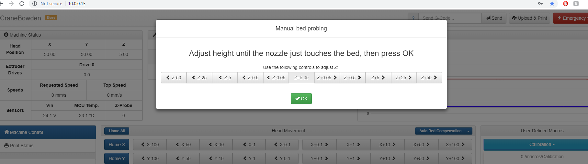

# Manual Bed Leveling

## Manually Leveling your M3D Crane printer bed:

The M3D Crane Series of printers comes pre-configured with a set of coordinates for manual bed leveling. This guide will walk you through a simple, yet highly effective manual bed leveling procedure that relies upon the pitch of the screws in each corner of your print bed.

## Starting the Manual Bed Leveling macro:

Using the Duet Web Control interface, be sure you are on the **Machine Control** tab by simply clicking Machine Control in the middle right of the interface. Once you are on the Machine Control tab, you will see on the left side of the screen a section called **User-Defined Macros.** There you will see a series of drop down menus in blue. Select the **Calibration** macro drop down, then select **Manual Bed Leveling** to begin the **Manual Bed Leveling sequence**.  

## Bed Leveling assistant:

A window will pop up over the Duet Web Interface that will begin walking you through the Manual Bed Leveling process. Using a combination of baby stepping \(0.05 Z adjustments\), manual observation and "paper testing" the Bed Leveling assistant will allow you to determine level at each of the four screw head points. 

## Adjusting the pitch of your screws:

After running the Bed Leveling assistant you will be given accurate instructions on what changes must be made to each of the four screws in your print bed. You will then be able to turn each screw UP or DOWN by a carefully determined amount to give you an extremely accurate leveling of your print bed.  

Now that your bed is leveled you can move on to Slicing and Printing your first print with the M3D Crane Series of printers! If you would like a more in-depth explanation of how this Manual Bed Leveling process works you will find it [here](https://duet3d.dozuki.com/Wiki/Using_the_manual_bed_levelling_assistant). 

