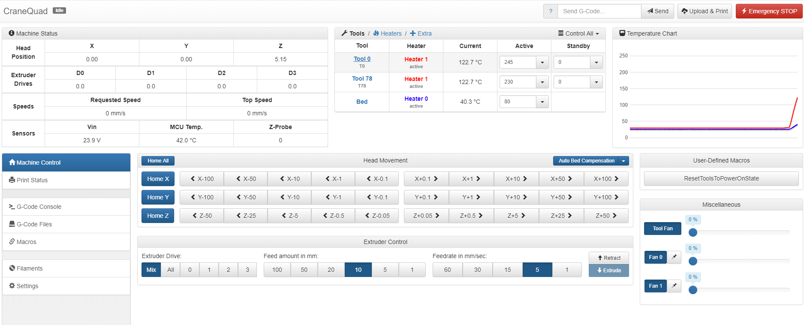
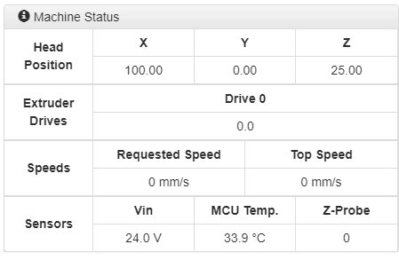
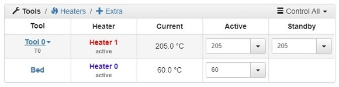
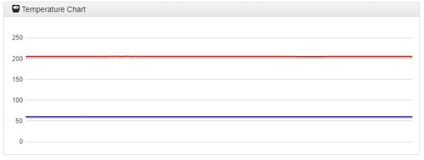
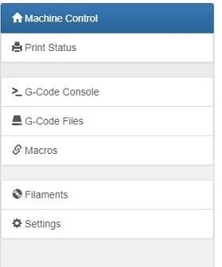
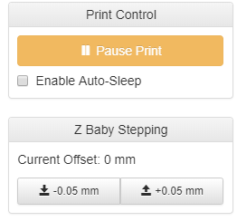
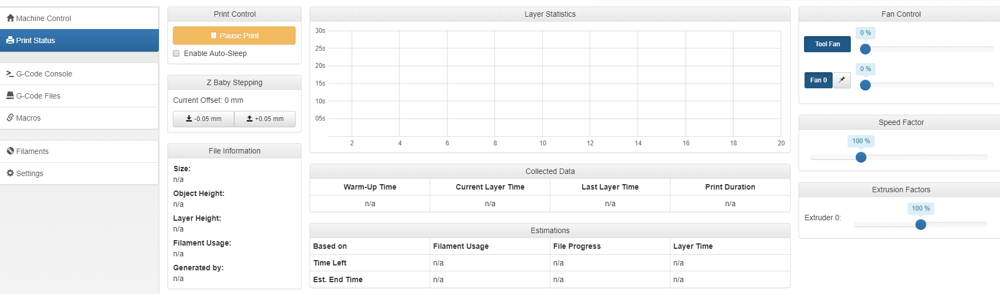

# Duet Web Control First Look

## Getting to know your Duet Web Control Interface: 

Now that the **Network Setup** is complete and you have arrived at the IP address your M3D Crane Series printer displayed during the Network Setup process, you can start to utilize the **Duet Web Control Interface**. There are many aspects you are able to monitor and control before, during and after printing from the Duet Web Control Interface. Here we will go over just the basics needed to get you up and printing as quickly as possible.

The Duet Web Control Interface provides a comprehensive way to monitor and make changes to nearly all aspects of your 3D printing process. This guide is focused on getting your M3D Crane Series printer up and printing quickly. Links will be provided at the end of this tutorial to allow a more in-depth understanding of all the various functions of the Duet Web Control Interface.

## Duet Web Control Interface First Look: 

## The upper portion of the Duet Web Control Interface will display real time information: 

The **Machine Status** section displays the **current axis positions, extruder drive positions, Speeds and Z-probe reading**.

 The **Tools** section provides a place to input and monitor the **temperature** of the various tools such as the **nozzle** and the **bed**.

 The **Temperature Chart** section will provide a real time chart showing the **temperature increase and decrease of the bed and the nozzle**. 

## The Lower portion of the Duet Web Control Interface is Dynamic: 

 It contains the **Main Menu Section**, which is comprised of tabs that display their information/interface in the middle portion of the lower half of the Duet Web Control Interface. Under the Machine Control tab you can find the **Axes and extruder control.** The Lower left portion contains the **User-Defined Macros** section.

## Print Status Tab: 

The **print status tab** will not display any information until a print is started, but once you have uploaded and started a print you will see **real time progress** as well as be able to **make changes in real time** to your print as it's printing, such as **micro stepping** or using the **Fan Control section**, changing **fan speeds and ratios.**

 The **Print control** section enables you to **pause, cancel or resume** a print, and allows you to make small adjustments to the Z axis called **Z baby stepping**.

 The **File information** section **displays select information about the gcode file you have uploaded** to print.

These are the very basics of the Duet Web Control Interface. We'll go over more about the Macro function during the Bed Leveling Assistant section of this guide, but for more comprehensive and in-depth information on each of the features of the Duet Web Control Interface, click [HERE](https://duet3d.dozuki.com/Wiki/Duet_Web_Control_Manual#Section_Overview).

Now that you are more familiar with the Duet Web Control Interface, it's time to move on to the hands on work of leveling your M3D Crane Dual's print bed. In the next section we will cover a simple Basic Leveling method.  

