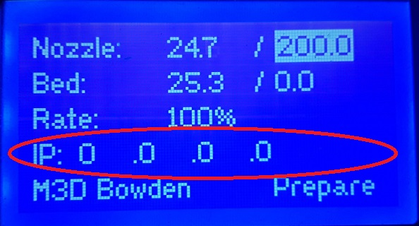

# First time Network Setup

Connecting to your M3D Crane Series Printer via your local network is very useful as you get access to the **Duet Web Control**. You can connect your M3D Crane Series Printer to your local network via the **Ethernet port on the Duet Maestro.** Once the network settings are properly configured, you will be able to connect to the **Duet board** and access the **Duet Web Control.**

## First-Time Start-up 


The M3D Crane Series printers are pre-configured to easily work with the most common network configuration, **DHCP**. If however you have a more complex network configuration set up it may be necessary to further edit your network settings.


Pre-configured network settings are loaded onto every SD card before the printer goes out our door. these network settings utilize **DHCP** in order to get an IP address from your router. This should allow your printer to connect automatically to your network. 

Once connected via **Ethernet** your ****M3D Crane Series printer will display an **IP address** on the Main Menu of the LCD screen. 

After your printer has had the time to start up, direct your browser to the address http://&lt;IP address&gt;. If the connection is successful the **Duet Web Control** should be shown. 

You have completed the network setup. If you are unable to access Duet Web Control you may need to contact your Network Administrator. 

Now that the network has been set up it's time to learn how to navigate the LCD menu on your M3D Crane Dual printer. Follow the guide to the next section to learn more about the LCD menu. 

 

