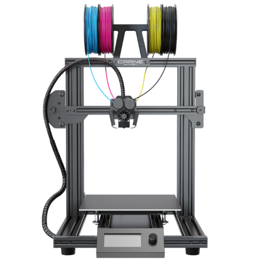
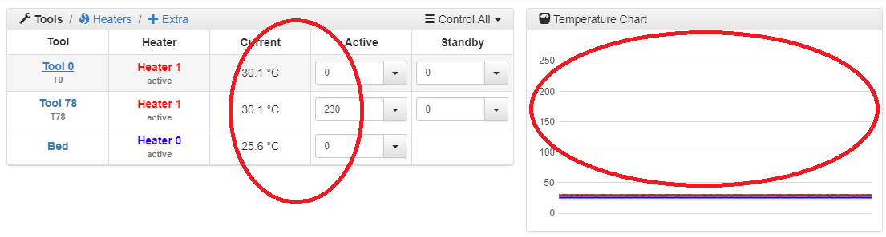

# Heating the bed and the Nozzle


There are several options available to control your M3D Crane Series printer. We recommend using the menus provided within the Duet Web Control Interface, however you can also control it via the gcode tab within the Duet Web Control Interface by typing in gcode commands directly, or you can control your M3D Crane Series printer manually through the menu on the LCD screen. This guide will focus on using the menu options inside the Duet Web Control Interface. The other options will be covered elsewhere in the guide.


## Using Duet Web Control Interface to Heat the print bed: 


Prior to every heating of the nozzles or the bed, check the temperature readouts in the _Current_ column on the Duet Web Console. These values should be in the 20°C - 250°C. A value of 2000°C, indicates a problem in the wiring of the thermistor. Fix the issue prior to activating the heaters.


Connect to your **Duet Web Control Interface** via your network using the **IP address** your M3D Crane Series printer displayed during the network setup step. Once you are connected, you can proceed to heating up your printer bed.

In the **Duet Web Console Interface** find the table: _**Tools/Heaters/Extra**_ pictured below. In the row **Bed** **change the active temperature** from 0C to your **desired temperature** and press **Enter**.

In order to turn the heated **bed off,** set the temperature back to **0** in the **Active** column and press **Enter**.


It can take a few minutes for the bed to reach the desired temperature and for the heat to dissipate.


You can monitor the heating of your bed in both the **Tools** as well as the **Temperature Chart** sections of the Duet Web Control Interface. The Current column within the Tools section will display the temperatures as they change, and the chart will show you the temperature progression allowing you to easily spot any unwanted spikes or drops in the bed or nozzle.

## **Heating the Nozzles with Duet Web Console:** 

In the **Duet Web Control Interface** find the table **Tools/Heaters/Extra**, pictured below. You will be selecting **Tool 0**, which represents your nozzle. Once your tool \(**Tool 0**\) is selected, simply change the **Active temperature from 0C to your desired temperature**.


Remember that the tool will only heat up to your set active temperature when the tool is **selected**.


In order to **turn off the heater,** set the tools **active temperature to 0 and press Enter**. Remember that a tool will heat up to the standby temperature when the tool is not selected, but was previously selected. You can see which tool is activated by the underline of the tool name in the Duet Web Console.

Now you know the basics of heating your bed and nozzle it's time to move on to loading and unloading filament!

