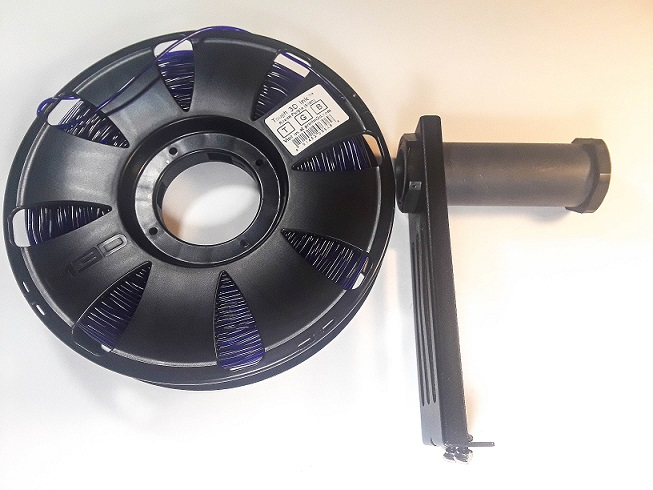
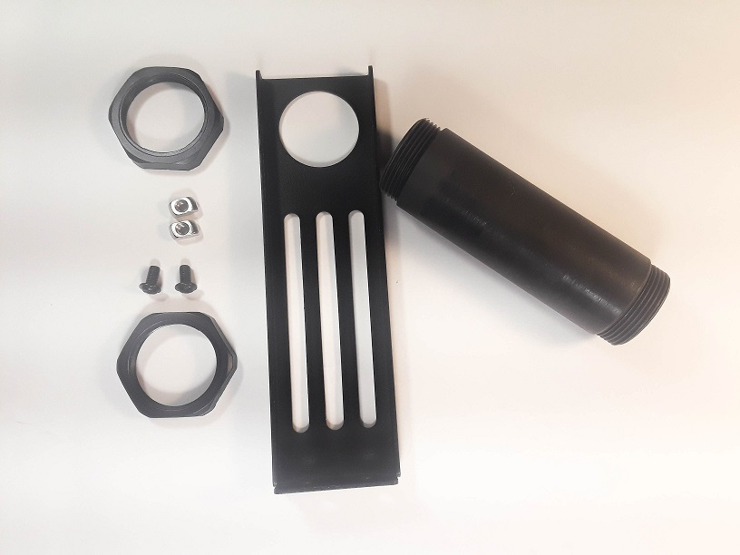
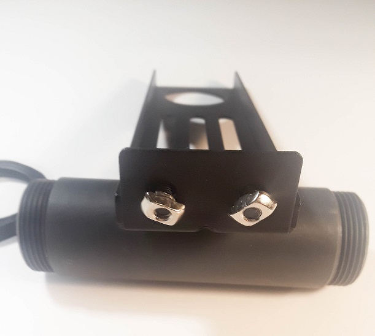
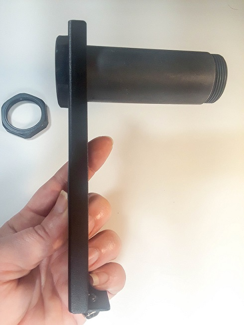
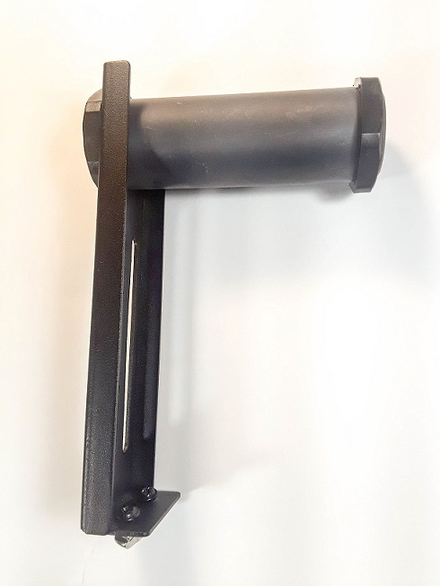

# Unboxing and Assembly


The M3D Crane Dual contains sensitive electronics, delicate mechanical parts, and an electrical heating system. Please exercise all applicable safety precautions and follow this guide closely to avoid damage to your M3D Crane Dual, to avoid injury to yourself or others, and insure proper operation.


## Setting up after unboxing your printer: 

After removing your M3D Crane Dual from the box, remove all the plastic wrapping being careful not to cut any of the sensitive parts of the device, such as the cables. Your M3D Crane Dual should look like this:

Remove the bolts at the bottom of each upright rail, as shown below. Setting them aside briefly:


Inspect your M3D Crane Dual for any damage that may have occurred during shipping. Every precaution has been made to prevent this, however it is advisable to give all the components a thorough inspection before operation. If any issues are discovered, document the damage by taking an image of the affected area and contact M3D immediately.


 As long as no issues are discovered, you are ready for mechanical assembly. 

## Assembly: 

Being careful not to stress or pull any of the cables, have a friend assist you in raising the upright rails; be sure to **align the bolt holes**.

If you aren't able to hold the upright in place, get someone's help to steady it. Line up the bolt holes \(that previously housed the bolts you removed\) and begin slowly tightening the bolts; first hand tighten, then slowly tighten more firmly with the provided **Allen Key**.

Ensure that all motor cables are connected. These are part of the **black ribbon cable**. You can identify the correct motor cable by looking at the **yellow tags reading 'X, Y, and Z'.** The motor connections are made up of 4 wires, while the associated endstop cable is a three wire cable directly beside the 4-wire cable for the respective motor; the only motor without an endstop is the extruder.

Connect the two gray ribbon cables labeled '1' and '2' and connect them to their respective ports on the back of the LCD assembly, 'EXP1' and 'EXP2'. **Be careful not to cross these connections as it may damage the LCD Screen.**

After making the connections, use the provided bolts and Allen Key to secure the LCD to the front of the M3D Crane Dual.

## Z endstop positioning:

In order to ensure nothing is damaged during shipping, and furthermore during the first power on of your M3D Crane Quad, it's been shipped with the Z endstop raised. You will need to manually lower your Z endstop before any printing can occur. 

Be sure your M3D Crane Quad is powered off, and or unplugged before you begin this step. 

The first step to moving your Z endstop is to tighten all four of your bed nuts so that only about 8-10 threads are exposed on each. 

Next you will need to manually center the print head over the bed. To do this gently move the print head along the Z axis until it's in the desired position. 

Loosen the Z endstop bracket by loosening the 2 screws that secure the bracket to the rail. 

Slowly lower the print head until the nozzle touches the bed. 

Little by little raise the Z endstop until a click is heard/felt and then tighten down the 2 screws again. 

Manually raise your print head/Z axis and now you are ready to power on the M3D Crane Quad and select Home All in the LCD menu. 

## Spool Holder:

The M3D Crane Dual includes 2 spool holders. One is a 3D printed Spool Holder, designed to hold the 4 smaller spools of 3DInk Filament necessary to take full advantage of it's dual color/material capabilities and the other Spool Holder included is better suited to hold the larger spools of 3DInk Filament. Here we show how to assemble the larger of the spool holders. 

The Spool Holder is comprised of the following parts:

* 2 T-nuts
* Mounting Bracket
* Spool Mount Spindle
* 2 End Caps

To assemble the Spool Holder screw the T-nuts into the holes at the bottom of the Mounting Bracket. Be sure to leave them fairly loose as you will tighten them firmly once the Mounting Bracket has been attached to the top rail of your M3D Crane Dual printer. 

Once the T-nuts are in place, slip one end of the Spool Mount Spindle through the large hole in the top of the Mounting Bracket and secure with an End Cap. 

The Spool Holder is designed so that the End Cap secures the spool and prevents it from slipping off the Spool Mount Spindle while in use. When not in use it's advised to keep the End Cap secured to the Spool Mount Spindle to prevent it from becoming lost or misplaced. 

Once your Spool Holder is fully assembled simply slip the T-nuts into the grove on the top rail of your M3D Crane Dual printer and tighten securely.


Prior to exiting this section, please double check all connections, and place your  M3D Crane Dual on a flat surface. Ensure the Power Switch is Off\(O\), double check that your voltage is set appropriately for YOUR area\(consult local authorities if you are unsure\). **Failure to do this can irreparably harm the electronics in your printer.**


Once your M3D Crane Dual is complete it should look like this:

Congratulations!! You have assembled your new M3D Crane Dual printer!! Move on to the next section to learn how to add the M3D Crane Dual to your existing network or setup a network from scratch.  

