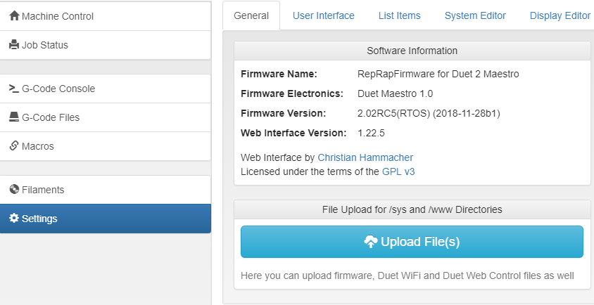
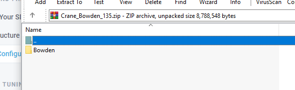
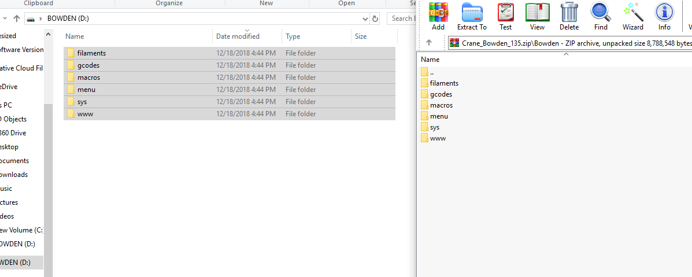

# Firmware/Configuration

It is very important that your M3D Crane Series printer has the most up to date software. In order to ensure the software is the newest version, you will need to identify what version of the software you are currently running. 

## Identifying Firmware Version

In order to identify your Firmware version you will need to go into your **Duet Web Control Console** and select the **Settings** option on the left side of the screen. Under the General tab, all of the **Firmware Versions** are listed. 

Once you have identified your software version and determined it is in need of an update follow this guide closely in order to successfully update your M3D Crane Series printer. These updates must be done in order. 

1. Firmware
2. Duet Web Control
3. Configuration Files

If you have an SD card reader, it is recommended that you simply remove the SD card from your M3D Crane Series printer, place it in your computer's SD card reader and drag and drop the Configuration updates. However the Firmware and the Duet Web Control files must be updated using the process described below. 


Updating your firmware is important in order to obtain the latest features and bug fixes. The Duet Maestro board uses a fork of RepRap firmware to control a 3D printer. 


## Firmware:

Our firmware updates, courtesy of user dc42 can be found here: [https://github.com/dc42/RepRapFirmware/releases/tag/2.02RC5](https://github.com/dc42/RepRapFirmware/releases/tag/2.02RC5)

| Version  | Description  | Author  |
| :--- | :--- | :--- |
| 2.02RC5 | [System Firmware](https://github.com/dc42/RepRapFirmware/releases/download/2.02RC5/DuetMaestroFirmware.bin) | dc42 |
| 1.22.5 | [Duet Web Control](https://github.com/dc42/RepRapFirmware/releases/download/2.02RC5/DuetWebControl-1.22.5.zip) | dc42 |

## Updating System Firmware

1. Download the firmware version linked above. This will be a _.bin_ or binary file called _**DuetMaestroFirmware.bin**_.
2. Go to the _**settings**_ tab of the Duet Web Console and find the ****_**Upload File\(s\)**_ button. Files uploaded here will be stored in the ****_**sys/**_ ****directory of the microSD card. Upload the _**DuetMaestroFirmware.bin**_ files.  
3. When the firmware upgrade is completed, you can visit the _**Settings**_ ****tab in order to ensure that the _**Firmware Version**_ has been updated. 

## Updating Duet Web Console:

1. Download the Duet Web Control update linked above. This will be _**.zip**_ file. \(No need to unpack this .zip file as it will be uploaded as a .zip\)
2. Go to the _**Settings**_ tab of the Duet Web Console and find the _**Upload File\(s\) button.**_ Upload the _**DuetWebControl.zip**_ file. 
3. When the Duet Web Control console is finished updating it will automatically _**restart**_. Once it's restarted, you can go to the _**Settings**_ tab in order to ensure the Duet Web Control has been updated.  

## Configuration Files:

These Configuration Files are for use with Duet Firmware 2.02RC5. This update is tested and official but still being actively updated. [https://github.com/PrintM3D/Crane/releases](https://github.com/PrintM3D/Crane/releases)

| Version | Description | Author |
| :--- | :--- | :--- |
| 2.02RC5: \(1.35\) | [M3D Crane Bowden](https://github.com/PrintM3D/Crane/releases/download/1.35-master/Crane_Bowden_135.zip) | M3D |
| 2.02RC5: \(1.35\) | [M3D Crane Dual ](https://github.com/PrintM3D/Crane/releases/download/1.35-master/Crane_Dual_135.zip) | M3D |
| 2.02RC5: \(1.35\) | [M3D Crane Quad](https://github.com/PrintM3D/Crane/releases/download/1.35-master/Crane_Quad_135.zip) | M3D |

## Configuration Updates via SD Card:

Updating the Configuration files involves copying the new versions of the configuration files to your M3D Crane Series printer's SD card. You will need an SD card reader in order to update the configuration files using this method. Be sure your M3D Crane Series printer is powered OFF before removing the SD card. The Configuration files that must be updated are **/sys/, /macros/**, and **/menu**. You may wish to back up your /macros/ in order to prevent any gcode files, slices, or macros you wish to save from being overwritten during the update process.  

1. Download the Configuration files appropriate to your M3D Crane Series printer. For this example we will show the process for M3D Crane Bowden. 
2. Power down your M3D Crane Series printer. Remove the SD card by pressing it firmly until you feel it release.
3. Insert the SD card into your SD card reader and open the SD drive on your PC. Now is the time to make backups of any files on your SD card you wish to keep. 
4. Open the folder containing the new Configuration files and copy them to the SD card. Replace and override when prompted. 

## Video Tutorial:

The following video tutorial is from our **User Submissions** made by **M3D Crane Series user Tylerun**. Our Firmware Updates are no longer in pre-release however once you've downloaded the new Firmware and Duet Web Control Updates from this page, following the remainder of the video tutorial will result in accurate updates.   



##  


**Warning: Updating your firmware can cause unintended consequences. Be aware that upgrading or downgrading to unstable firmware versions can cause unexpected bugs and issues. Use caution!**


## Other Resources

1. [Duet 3D Wiki: Updating and Installing Firmware](https://duet3d.dozuki.com/Wiki/Installing_and_Updating_Firmware)
2. [Duet3D Forum](https://forum.duet3d.com/): For firmware and Duet specific questions
3. [Duet Fork of RepRap Firmware](https://github.com/dc42/RepRapFirmware)

